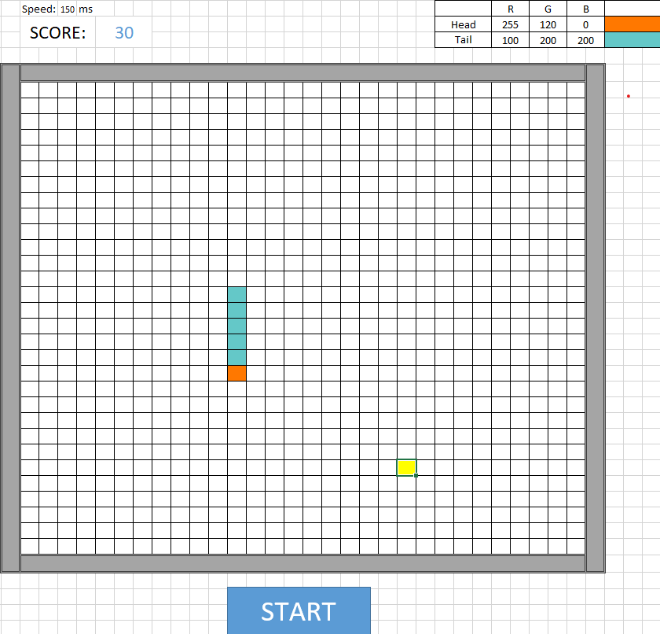

# Snake Game in Excel (VBA)

Welcome to the **Snake Game** created entirely using Excel and VBA macros! You can find and play the game by downloading the file `Snake.xlsm`. The code is included both in the Excel file and separately in this repository.

## How to Download and Play

1. **Download the Game:**
   - The game is available for download in the `Snake.xlsm` file. Once downloaded, you can open it in Excel.

2. **Enabling Macros:**
   - To play the game, you need to enable VBA macros in Excel. When opening the file, you'll be prompted to enable content. Click **Enable Content** or **Enable Macros** to allow the game to run.
   
3. **Start the Game:**
   - After enabling macros, you can start the game by clicking the **Start** button (or running the `Start` subroutine in the VBA editor).
   - Use the arrow keys to control the movement of the snake.

## Customizing the Snake's Appearance

You can change the snake's color directly within the Excel file:
- The snake's head and body colors are determined by the RGB values in the cells:
  - **AM4, AO4, AQ4**: RGB values for the head of the snake.
  - **AM5, AO5, AQ5**: RGB values for the body of the snake.
- The color will automatically update once the values are changed.

## Accessing and Viewing the Code

You can view and modify the VBA code directly from the Excel file:
1. Press **Alt + F11** to open the **VBA Editor**.
2. The code is divided into three main parts:
   - **Part 1**: The snake's color settings are in the "ThisWorkbook" module.
   - **Part 2**: The game logic (movement, apple generation, collision detection) is in the main module.
   - **Part 3**: The timer control, responsible for the snake's movement speed, is in the timer module.

## Code Repository

The code for the Snake Game is also available directly in this repository under the `Code for the Snake Game` folder. You can copy the VBA code and integrate it into your own Excel interface, customize it to fit your preferences, and test it out!

- **Note**: Make sure to set up the Excel interface similar to how it's done in the provided file to ensure the game works properly.

Enjoy the game and feel free to explore or modify the code to create your own version of the classic Snake game!
